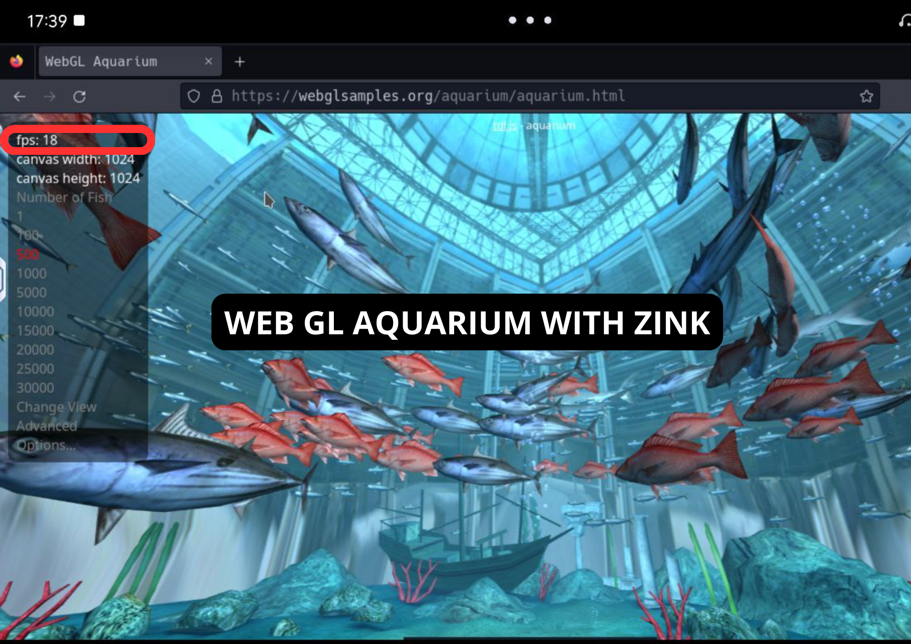
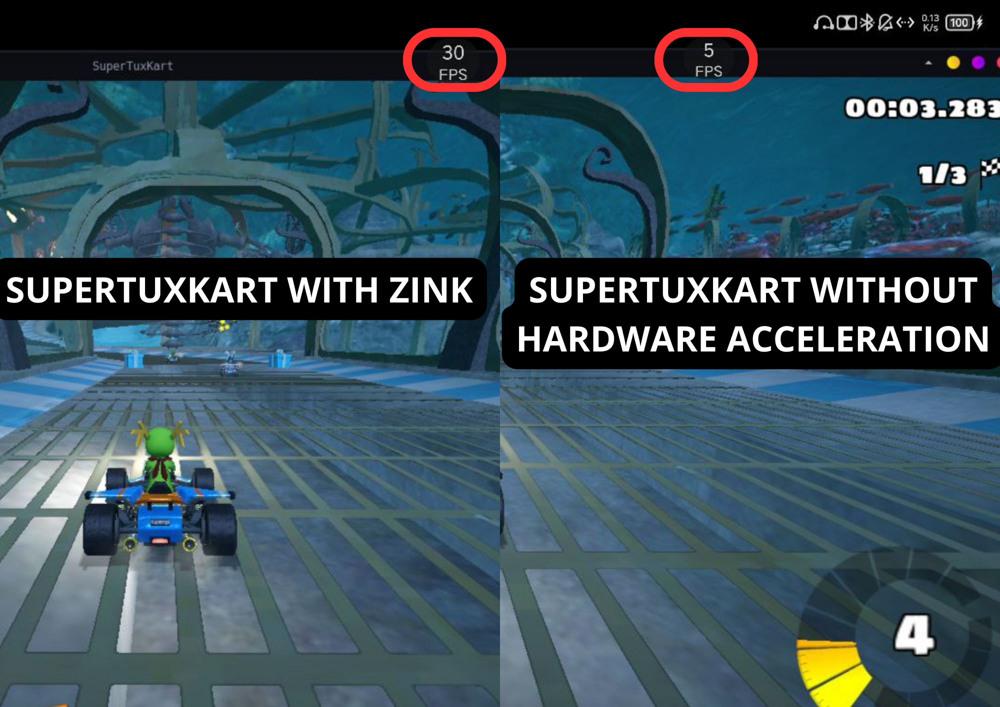

* It is highly recommended that you read [terminology](./terminology.md) first.

# 📚 Index
* 💻 [Hardware Acceleration in Termux (Proot & Chroot)](#hardware-acceleration-prootandchroot)
* 💻 [Hardware Acceleration in Termux Native](#hardware-acceleration-termux-native)
* 🪲 [Troubleshooting and fixes](#troubleshoot)

<br>
<br>  

---  
<br>

# Hardware Acceleration in Termux (Proot & Chroot) <a name=hardware-acceleration-prootandchroot></a>
> [!NOTE]  
> I would like to include here all the information I got while I am still researching the subject as the world of hardware acceleration is huge.. If you find any errors  or misconceptions, please comment on Youtube, Telegram or open an issue on this Github

🔥[[Video] Hardware Acceleration Part 1 - What it is, how it is used (VIRGL AND ZINK)](https://www.youtube.com/watch?v=fgGOizUDQpY)  
🔥[[Video] Hardware Acceleration Part 2 - (VIRGL, ZINK, TURNIP) - how can you use them](https://www.youtube.com/watch?v=07kq4RHbXrE)  
🔥[[Video] Hardware Acceleration Part 3 - How to run a full Desktop with Hardware Acceleration](https://youtu.be/OiLXkvFoUJQ?feature=shared)

## 1. Install packages
You need to install the following packages in Termux: 
```
pkg install mesa-zink virglrenderer-mesa-zink vulkan-loader-android virglrenderer-android
```

## 2. Initialize graphical server in Termux: 
Before login to proot and use hardware acceleration you need to start the graphical server: 

* Vulkan (ZINK):
```
MESA_NO_ERROR=1 MESA_GL_VERSION_OVERRIDE=4.3COMPAT MESA_GLES_VERSION_OVERRIDE=3.2 GALLIUM_DRIVER=zink ZINK_DESCRIPTORS=lazy virgl_test_server --use-egl-surfaceless --use-gles &
```
* OpenGL (VIRGL):
```
virgl_test_server_android &
```
* [Turnip (Adreno GPU 6XX/7XX compatible only)](https://www.reddit.com/r/termux/comments/19dpqas/proot_linux_only_dri3_patch_mesa_turnip_driver/)
It is not needed to initialize any graphical server. Follow the steps described in the reddit post. As as summary:

  1. Download Turnip Driver: [mesa-vulkan-kgsl_23.3.0-devel-20230905_arm64.deb](https://drive.google.com/file/d/1f4pLvjDFcBPhViXGIFoRE3Xc8HWoiqG-/view?usp=drive_link)
  2. Install it in proot-distro (for example in Debian the command is as follows)
```
sudo dpkg -i mesa-vulkan-kgsl_23.3.0-devel-20230905_arm64.deb
```
  In case you want to remove the driver: 
```
sudo dpkg -r mesa-vulkan-drivers:arm64
```


## 3. In proot distro 
Run the Desktop with my script (if you do manually instead of using my script, take in to account that you need to share the tmp dir to make it work): 
```
./startxfce4_debian.sh
```

Once in the Desktop when you want to run a program with hardware acceleration use this before: 

* For VIRGL and ZINK (depending on the graphic server you started in Termux it will use ZINK or VIRGL): 
```
GALLIUM_DRIVER=virpipe MESA_GL_VERSION_OVERRIDE=4.0 program
```
* For TURNIP: 
```
MESA_LOADER_DRIVER_OVERRIDE=zink TU_DEBUG=noconform program
```

# Performance results 

Device used: Lenovo Legion Y700 2022 model (Snapdragon 870 - Adreno 650)

### GLMARK2
To install glmark2: 
```
# In Termux: pkg install glmark2
# In proot-distro (Debian): sudo apt install glmark2
```
> [!IMPORTANT]  
> The following tests were done in a proot distro environment with Debian and a XFCE4 desktop.

<table>
  <thead>
    <tr>
      <th scope="col" colspan="6">DEBIAN PROOT (GLMARK2 SCORE - the higher the number the better the performance)</th>
    </tr>
    <tr>
        <th scope="col">RUN</th>
        <th scope="col">LLVMPIPE</th>
        <th scope="col">VIRGL</th>
        <th scope="col">VIRGL ZINK</th>
        <th scope="col">TURNIP</th>
        <th scope="col">ZINK</th>
    </tr>
  </thead>

  <tbody>
    <tr>
      <td>1</td>
      <td>93</td>
      <td>70</td>
      <td>66</td>
      <td>198</td>
      <td>Error</td>
    </tr>
    <tr>
      <td>2</td>
      <td>93</td>
      <td>77</td>
      <td>66</td>
      <td>198</td>
      <td>Error</td>
    </tr>
    <tr>
      <td>3</td>
      <td>72</td>
      <td>70</td>
      <td>71</td>
      <td>198</td>
      <td>Error</td>
    </tr>
    <tr>
      <td>4</td>
      <td>94</td>
      <td>76</td>
      <td>66</td>
      <td>197</td>
      <td>Error</td>
    </tr>
    <tr>
      <td>5</td>
      <td>93</td>
      <td>75</td>
      <td>67</td>
      <td>198</td>
      <td>Error</td>
    </tr>
  </tbody>
  <tfoot>
    <tr>
      <th scope="row">Initialize server</th>
      <td>Not needed</td>
      <td><code>virgl_test_server_android &</td>
      <td><code>MESA_NO_ERROR=1 MESA_GL_VERSION_OVERRIDE=4.3COMPAT MESA_GLES_VERSION_OVERRIDE=3.2 GALLIUM_DRIVER=zink ZINK_DESCRIPTORS=lazy virgl_test_server --use-egl-surfaceless --use-gles &</code></td>
      <td>Not needed</td>
      <td><code>MESA_NO_ERROR=1 MESA_GL_VERSION_OVERRIDE=4.3COMPAT MESA_GLES_VERSION_OVERRIDE=3.2 GALLIUM_DRIVER=zink ZINK_DESCRIPTORS=lazy virgl_test_server --use-egl-surfaceless --use-gles &</code></td>
    </tr>
    <tr>
      <th scope="row">Command used</th>
      <td><code>glmark2</td>
      <td><code>GALLIUM_DRIVER=virpipe MESA_GL_VERSION_OVERRIDE=4.0 glmark2</td>
      <td><code>GALLIUM_DRIVER=virpipe MESA_GL_VERSION_OVERRIDE=4.0 glmark2</td>
      <td><code>MESA_LOADER_DRIVER_OVERRIDE=zink TU_DEBUG=noconform glmark2</td>
      <td><code>GALLIUM_DRIVER=zink MESA_GL_VERSION_OVERRIDE=4.0 glmark2</td>
    </tr>
    <tr>
      <th scope="row">GLMARK GPU Info</th>
      <td>llvmpipe</td>
      <td>virgl (Adreno)</td>
      <td>virgl (zink Adreno)</td>
      <td>virgl (Turnip Adreno)</td>
      <td>zink (Adreno)</td>
    </tr>
  </tfoot>
</table>

---

> [!IMPORTANT]  
> The following tests were done in Termux (NOT in proot-distro) and a XFCE4 desktop.

<table>
  <thead>
    <tr>
      <th scope="col" colspan="6">TERMUX NO PROOT (GLMARK2 SCORE - the higher the number the better the performance)</th>
    </tr>
    <tr>
        <th scope="col">RUN</th>
        <th scope="col">LLVMPIPE</th>
        <th scope="col">VIRGL</th>
        <th scope="col">VIRGL ZINK</th>
        <th scope="col">ZINK</th>
        <th scope="col">TURNIP</th>
    </tr>
  </thead>

  <tbody>
    <tr>
      <td>1</td>
      <td>69</td>
      <td>Error</td>
      <td>92</td>
      <td>121</td>
      <td>Doesn't apply</td>
    </tr>
    <tr>
      <td>2</td>
      <td>70</td>
      <td>Error</td>
      <td>92</td>
      <td>122</td>
      <td>Doesn't apply</td>
    </tr>
    <tr>
      <td>3</td>
      <td>69</td>
      <td>Error</td>
      <td>93</td>
      <td>121</td>
      <td>Doesn't apply</td>
    </tr>
    <tr>
      <td>4</td>
      <td>69</td>
      <td>Error</td>
      <td>93</td>
      <td>124</td>
      <td>Doesn't apply</td>
    </tr>
    <tr>
      <td>5</td>
      <td>69</td>
      <td>Error</td>
      <td>93</td>
      <td>123</td>
      <td>Doesn't apply</td>
    </tr>
  </tbody>
  <tfoot>
    <tr>
      <th scope="row">Initialize server</th>
      <td>Not needed</td>
      <td><code>virgl_test_server_android &</td>
      <td><code>MESA_NO_ERROR=1 MESA_GL_VERSION_OVERRIDE=4.3COMPAT MESA_GLES_VERSION_OVERRIDE=3.2 GALLIUM_DRIVER=zink ZINK_DESCRIPTORS=lazy virgl_test_server --use-egl-surfaceless --use-gles &</code></td>
      <td><code>MESA_NO_ERROR=1 MESA_GL_VERSION_OVERRIDE=4.3COMPAT MESA_GLES_VERSION_OVERRIDE=3.2 GALLIUM_DRIVER=zink ZINK_DESCRIPTORS=lazy virgl_test_server --use-egl-surfaceless --use-gles &</code></td>
      <td>Doesn't apply</td>
    </tr>
    <tr>
      <th scope="row">Command used</th>
      <td><code>glmkar2</td>
      <td><code>GALLIUM_DRIVER=virpipe MESA_GL_VERSION_OVERRIDE=4.0 glmark2</td>
      <td><code>GALLIUM_DRIVER=virpipe MESA_GL_VERSION_OVERRIDE=4.0 glmark2</td>
      <td><code>GALLIUM_DRIVER=zink MESA_GL_VERSION_OVERRIDE=4.0 glmark2</td>
      <td>Doesn't apply</td>
    </tr>
    <tr>
      <th scope="row">GLMARK GPU Info</th>
      <td>llvmpipe</td>
      <td>virgl (Adreno)</td>
      <td>virgl (zink Adreno)</td>
      <td>zink (Adreno)</td>
      <td>Doesn't apply</td>
    </tr>
  </tfoot>
</table>


---
### [Firefox Aquarium WebGL Benchmark](https://webglsamples.org/aquarium/aquarium.html)

> [!NOTE]  
> You need to [enable WebGL in Firefox](https://tecnorobot.educa2.madrid.org/tecnologia/-/visor/configurar-webgl) to use the GPU

<table>
  <thead>
    <tr>
      <th scope="col" colspan="4">DEBIAN PROOT (FIREFOX-ESR WEBGL AQUARIUM FPS - the higher the number the better the performance)</th>
    </tr>
    <tr>
        <th scope="col">LLVMPIPE</th>
        <th scope="col">VIRGL</th>
        <th scope="col">VIRGL ZINK</th>
        <th scope="col">TURNIP</th>
    </tr>
  </thead>

  <tbody>
    <tr>
      <td>4</td>
      <td>20</td>
      <td>17</td>
      <td>Web page crash</td>
    </tr>
  </tbody>
</table>

<table>
  <thead>
    <tr>
      <th scope="col" colspan="5">TERMUX NOT PROOT (FIREFOX-ESR WEBGL AQUARIUM FPS - the higher the number the better the performance)</th>
    </tr>
    <tr>
        <th scope="col">LLVMPIPE</th>
        <th scope="col">VIRGL</th>
        <th scope="col">VIRGL ZINK</th>
        <th scope="col">ZINK</th>
        <th scope="col">TURNIP</th>
    </tr>
  </thead>

  <tbody>
    <tr>
      <td>2</td>
      <td>Error</td>
      <td>24</td>
      <td>40</td>
      <td>Doesn't apply</td>
    </tr>
  </tbody>
</table>



---
Other tests I did: 

* SuperTuxKart tested during 30 seconds



# Hardware Acceleration in Native Termux  <a name=hardware-acceleration-termux-native></a>
(Freedreno and Turnip are only compatible with Adreno 610 and above with exceptions like 710, 642L, etc)

## Turnip
* Install
  ```
  apt install mesa-vulkan-icd-freedreno-dri3
  ```
* To run programs with turnip: 
  ```
  MESA_LOADER_DRIVER_OVERRIDE=zink PROGRAM
  ```

## Freedreno(Experimental)
> [!WARNING]
> This is still being tested, installing it will break your xfce4 desktop environment.
> Install at your own risk!
  #### Download freedreno & Build
  ```
  apt update
  apt install python3 bison
  pip install PyYAML
  
  wget https://gitlab.freedesktop.org/Pipetto-crypto/mesa/-/archive/freedreno/mesa-freedreno.tar.gz
  
  meson build --prefix $PREFIX -Dlibdir=$PREFIX/lib -D platforms=x11 -Dgallium-drivers=freedreno -Dfreedreno-kmds=kgsl,msm -D vulkan-drivers= -D dri3=enabled -D egl=enabled -D gles2=disabled -D glvnd=disabled -D glx=dri -D libunwind=disabled -D shared-glapi=enabled -Dshared-llvm=disabled -D microsoft-clc=disabled -D valgrind=disabled -D gles1=disabled
  ```
  #### Remove existing files
  If these files exist, then remove them(this will break your zink turnip installation!)
  ```
  rm /data/data/com.termux/files/usr/lib/libgbm.so
  rm /data/data/com.termux/files/usr/lib/libglapi.so
  ```
  
  #### Install
  ```
  ninja -C build install
  ```
  
  #### To run programs with freedreno kgsl:
  ```
  MESA_LOADER_DRIVER_OVERRIDE=kgsl PROGRAM
  ```

# Troubleshooting and fixes <a name=troubleshoot></a>

### Games not registering qwerty/WASD keys
To fix it  
```Termux:X11 -> Preferences -> Turn on "Prefer scancodes when possible"```

(another wordaround is to hold CTRL while pressing the qwerty keys although the solution above is more convenient and permanently fixes the issue)
