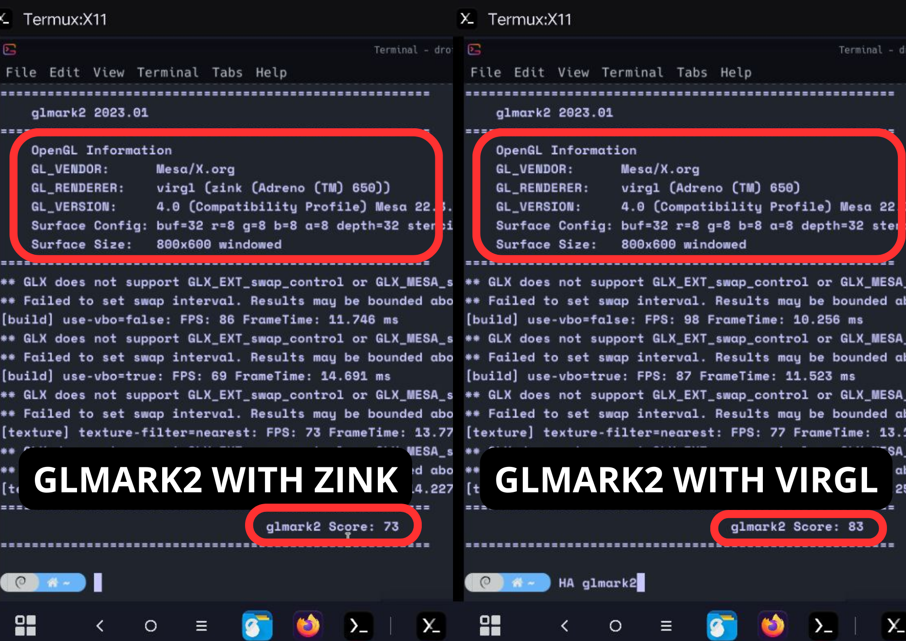

# Hardware Acceleration in Termux
> [!WARNING]  
> Work In Progress. I would like to include here all the info I got while I'm still researching the topic. 

## 1. Install packages
You need to install the following packages in Termux: 
```
pkg install mesa-zink virglrenderer-mesa-zink vulkan-loader-android
```

## 2. Initialize VIRGL server in Termux: 
Before login to proot and use hardware acceleration you need to start the virgl server: 

* If you have a Snapdragon CPU (ZINK):
```
MESA_NO_ERROR=1 MESA_GL_VERSION_OVERRIDE=4.3COMPAT MESA_GLES_VERSION_OVERRIDE=3.2 GALLIUM_DRIVER=zink ZINK_DESCRIPTORS=lazy virgl_test_server --use-egl-surfaceless --use-gles &
```
* If not (VIRGL):
```
virgl_test_server_android &
```

## 3. In proot distro 
Run the Desktop with my script (if you do manually take in to account that you need to share the tmp dir to make it work): 
```
./startxfce4_debian.sh
```

Once in the Desktop when you want to run a program with hardware acceleration use this before: 
```
GALLIUM_DRIVER=virpipe MESA_GL_VERSION_OVERRIDE=4.0 program
```
For example: 
```
GALLIUM_DRIVER=virpipe MESA_GL_VERSION_OVERRIDE=4.0 glmark2
```

# Performance results 
> [!IMPORTANT]  
> All this tests were done in a proot distro environment with Debian and a XFCE4 desktop. In brackets I put the % of improvement compared to the worst case scenario.


| Software | No Hardware Acceleration | H.A. using VIRGL | H.A. using ZINK (Snapdragon) |
| --- | --- | --- | --- |
| GLMAKR2 (points) | 167 (125.67%) | 90 (21.62%) | 74 (0%)|
| GLXGEARS (average fps) | 406 (178.08%) | 223 (52.73%) | 146 (0%) |
| SUPERTUXKART (average fps aprox.) | 5 (0%) | Seg Fault Error (crash) | 30 (500%) |
| Firefox Aquarium Benchmark | 4 (0%) | 22 (450%) | 17 (325%)  |


* GLMARK2 tested during 30 seconds with the following commands (runned 2 times)
```
glmark2
GALLIUM_DRIVER=virpipe MESA_GL_VERSION_OVERRIDE=4.0 glmark2
```


* GLXGEARS tested during 30 seconds with the following commands (runned 1 time and waited for 6 output messages)
```
glxgears
GALLIUM_DRIVER=virpipe MESA_GL_VERSION_OVERRIDE=4.0 glxgears
```
* SuperTuxKart tested during 30 seconds with the following commands (runned 1 time)
```
glxgears
GALLIUM_DRIVER=virpipe MESA_GL_VERSION_OVERRIDE=4.0 glxgears
```


* [Firefox Aquarium WebGL Benchmark](https://webglsamples.org/aquarium/aquarium.html) tested during 30 seconds with the following commands (runned 1 time in a 1024x1024 canvas).
> [!NOTE]  
> You need to [enable WebGL in Firefox](https://help.interplaylearning.com/en/help/how-to-enable-webgl-in-firefox) to use the GPU
  
```
firefox-esr
GALLIUM_DRIVER=virpipe MESA_GL_VERSION_OVERRIDE=4.0 firefox-esr
```

